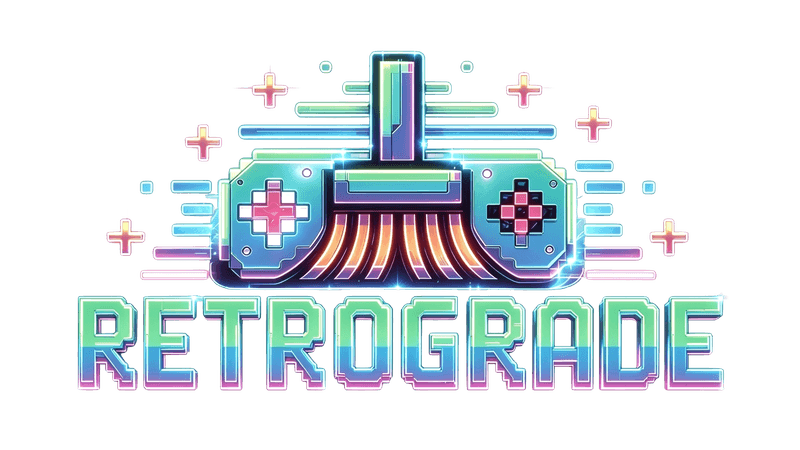

**Curadoria inteligente de coleções de jogos baseada em avaliações da IGDB e TheGamesDB.**

O **RetroGrade** é uma aplicação Desktop moderna, rápida e visualmente sofisticada para organizar bibliotecas de ROMs retro. Analisa milhares de arquivos, consulta APIs de bancos de dados e organiza sua coleção com base em notas e uma lista de clássicos protegidos.

---

## 🚀 Funcionalidades Principais

- **Interface Designer-First:** Tema Dark (Zinc-950), efeitos de vidro (glassmorphism), animações suaves com Framer Motion e feedback visual instantâneo.
- **Multi-Database:** Consulta notas automaticamente nas APIs da IGDB e TheGamesDB com fallback inteligente (IGDB primeiro, TGDB como backup).
- **Proteção de Clássicos:** Sistema de preservação automática que impede a remoção de franquias icônicas definidas no `classics.json`.
- **Dashboard em Tempo Real:** Acompanhe o progresso com contadores animados, barra de progresso global, card do sistema atual e log de atividades com scroll automático.
- **Gestão de Sistemas:** Suporte a 40+ consoles através do mapeamento customizável em `systems.json` (.nes, .sfc, .n64, .gba, .iso, etc).
- **Ação Configurável:** Escolha entre mover arquivos para pasta `/removidos` ou deletar permanentemente.
- **Histórico de Execuções:** Registro completo de todas as curadorias com data, pasta, totais e resultados.
- **Configuração via UI:** Modal de configurações integrado para editar credenciais de API, nota mínima e ação de remoção sem mexer em arquivos.

---

## 🛠️ Stack Tecnológica

- **Runtime:** Node.js (Windows 11 Nativo)
- **Framework Desktop:** [Electron](https://www.electronjs.org/) v30+
- **Bundler:** [Vite](https://vitejs.dev/)
- **Frontend:** [React](https://reactjs.org/) + TypeScript
- **Estilização:** [Tailwind CSS](https://tailwindcss.com/)
- **Ícones:** [Lucide React](https://lucide.dev/)
- **Animações:** [Framer Motion](https://www.framer.com/motion/)
- **Requisições:** Axios
- **File I/O:** fs-extra

---

## 📂 Arquivos de Configuração (JSON)

A aplicação mantém a persistência de dados em arquivos JSON locais na pasta `data/`:

| Arquivo              | Função                                                                  |
| :------------------- | :---------------------------------------------------------------------- |
| `config.json`        | Credenciais de API (IGDB Client ID/Secret e TGDB API Key).              |
| `classics.json`      | Lista de palavras-chave para proteger franquias (ex: "Mario", "Zelda"). |
| `systems.json`       | Mapeamento de extensões para IDs de plataformas IGDB/TGDB.              |
| `curator_stats.json` | Histórico completo de execuções com totais e resultados.                |

---

## 📦 Como Instalar e Rodar

### Requisitos

- Node.js >= 18.0.0
- Windows 11 (nativo)

### Desenvolvimento

1. **Clone o repositório:**
   ```bash
   git clone git@github.com:from80s/retrograde.git
   cd RetroGrade
   ```

2. **Instale as dependências:**
   ```bash
   npm install
   ```

3. **Configure as credenciais de API** em `data/config.json`:
   ```json
   {
     "IGDB_CLIENT_ID": "seu-client-id",
     "IGDB_CLIENT_SECRET": "seu-client-secret",
     "TGDB_API_KEY": "sua-api-key"
   }
   ```

4. **Rode em modo desenvolvimento:**
   ```bash
   npm run electron:dev
   ```

### Build para Produção

```bash
npm run electron:build
```

O build gera **dois formatos** na pasta `release/`:

| Arquivo | Tipo | Descrição |
| :--- | :--- | :--- |
| `RetroGrade Setup X.X.X.exe` | **Instalador NSIS** | Wizard de instalação com atalhos, desinstalação e opção de diretório |
| `RetroGrade X.X.X.exe` | **Portable** | Executável único, roda direto sem instalar |

**Instalador NSIS:**
- Permite escolher o diretório de instalação
- Cria atalhos na área de trabalho e Menu Iniciar
- Gera desinstalador automático em "Adicionar/Remover Programas"

**Portable:**
- Não requer instalação
- Pode ser executado de qualquer pasta ou pendrive
- Não deixa rastros no sistema após fechar

---

## 🏗️ Estrutura do Projeto

```
RetroGrade/
├── electron/
│   ├── main.ts           # Processo principal (IPC, APIs, file I/O)
│   ├── preload.ts        # Ponte segura contextBridge
│   └── tsconfig.json     # Config TypeScript do Electron
├── src/
│   ├── components/
│   │   ├── ActivityLog.tsx     # Log de atividades com scroll
│   │   ├── ProgressCard.tsx    # Barra de progresso + arquivo atual
│   │   ├── SettingsModal.tsx   # Configurações de API e curadoria
│   │   ├── StatCard.tsx        # Cards de estatísticas animados
│   │   ├── StatsHistory.tsx    # Histórico de execuções
│   │   └── TitleBar.tsx        # Barra de título customizada
│   ├── types/
│   │   ── global.d.ts         # Tipagem da API bridge
│   ├── App.tsx                 # Componente principal
│   ├── main.tsx                # Entry point React
│   └── index.css               # Tailwind + estilos customizados
├── data/
│   ├── classics.json           # Franquias protegidas
│   ├── config.json             # Credenciais de API
│   ├── systems.json            # Mapeamento de sistemas
│   └── curator_stats.json      # Histórico de execuções
├── assets/
│   └── images/
│       ├── RetroGrade.png      # Logo do app
│       └── RetroGrade_icon_app_256x256.png  # Ícone do executável
├── package.json
├── vite.config.ts
├── tailwind.config.js
└── tsconfig.json
```

---

## 🔌 Arquitetura IPC

O projeto utiliza comunicação segura entre processos via `contextBridge`:

- **Main Process:** Lida com `fs`, `path`, chamadas de API (IGDB/TGDB) e operações de arquivo
- **Renderer Process:** Responsável exclusivamente pela UI e estados React
- **Preload Script:** Expõe a ponte `window.api` com métodos seguros para o renderer

---

## 📋 Scripts Disponíveis

| Comando                  | Descrição                                    |
| :----------------------- | :------------------------------------------- |
| `npm run dev`            | Inicia o servidor Vite (apenas frontend)     |
| `npm run build`          | Build do frontend com Vite                   |
| `npm run electron:dev`   | Roda o app completo em modo desenvolvimento  |
| `npm run electron:build` | Build completo para produção                 |
| `npm run preview`        | Preview do build do frontend                 |

---

## 📝 Versionamento

O projeto segue o [Semantic Versioning](https://semver.org/lang/pt-BR/):

- **MAJOR** (X.0.0): Mudanças incompatíveis com versões anteriores
- **MINOR** (0.X.0): Novas funcionalidades compatíveis com versões anteriores
- **PATCH** (0.0.X): Correções de bugs compatíveis com versões anteriores

---

## 📄 Licença

MIT License - veja o arquivo [LICENSE](LICENSE) para detalhes.
